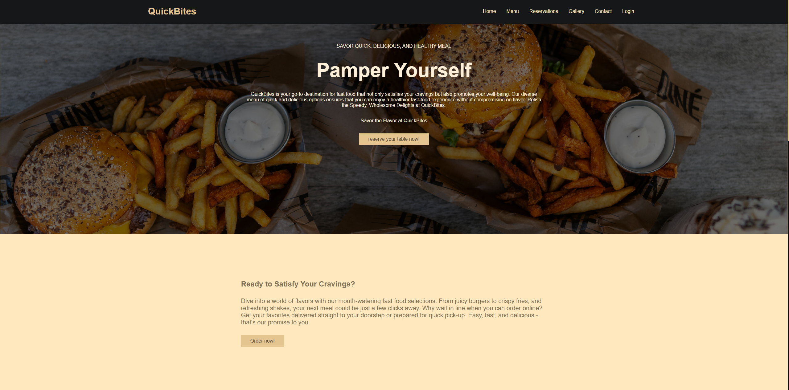
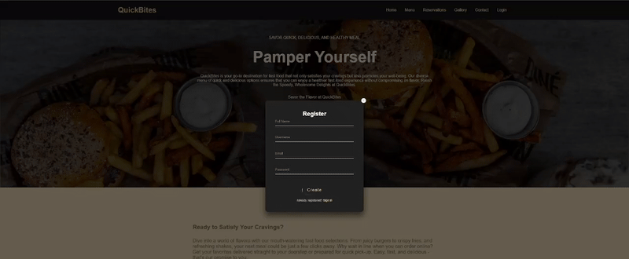
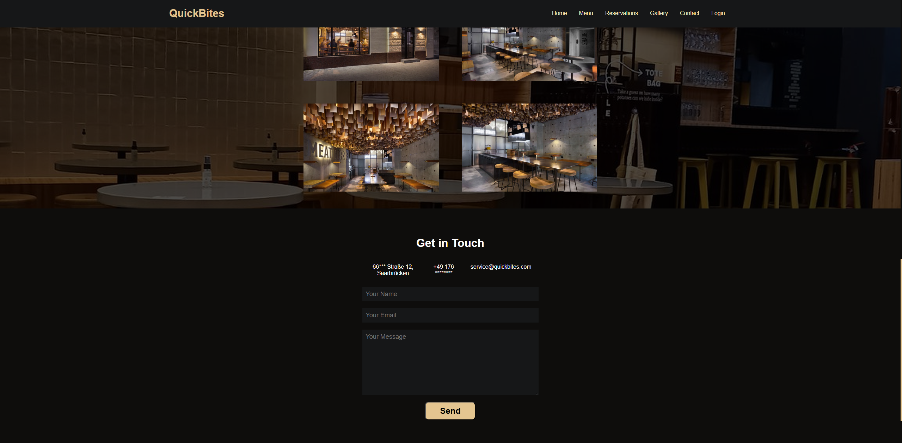
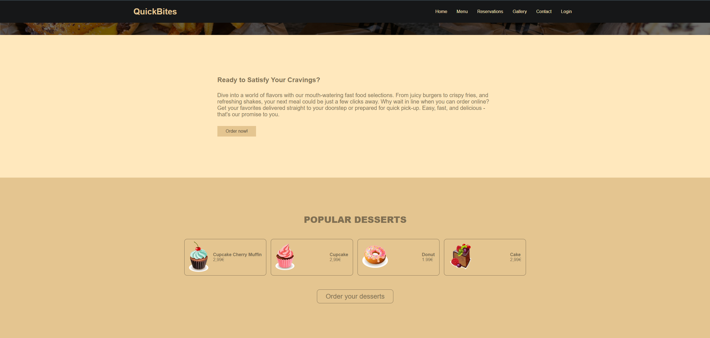

#  QuickBites - Restaurant-Management-System

**QuickBites** ist eine Webanwendung für Restaurant-Management mit Online-Bestellung und Tischreservierung.




# Ursprüngliche Entwicklung

Dieses Projekt wurde ursprünglich auf dem HTW GitLab entwickelt.  


##  Was kann die Anwendung?

- **Online-Speisekarte**: Kunden können das Menü durchsuchen und bestellen
- **Tischreservierungen**: Echtzeit-Reservierungssystem mit Verfügbarkeitsprüfung  
- **Benutzerverwaltung**: Anmeldung, Registrierung und Profil-Management
- **Warenkorb**: Einfaches Hinzufügen und Verwalten von Bestellungen
- **Responsive Design**: Funktioniert auf Desktop, Tablet und Handy

## Screenshots








##  Technologien

**Frontend:** HTML, CSS, JavaScript, Bootstrap  
**Backend:** Java, Spring Boot, PostgreSQL  
**Build-Tools:** npm, Gradle

## 🚀 Installation & Start

### 1. Voraussetzungen installieren
- **Java 17** oder höher
- **Node.js** und **npm** 
- **PostgreSQL** Datenbank

### 2. Datenbank einrichten
```sql
-- PostgreSQL Datenbank erstellen
CREATE DATABASE quickbites_db;
```

### 3. Konfiguration
- install postgresql
- configure your application.properties file for your own database
- install node
# How to run the app
- Running the backend server:
 - run QuickBiteApplication.java class
- Running the webApp:
 - Run on console :
    1.npm install
    2.npm run build
    3.npm run start
